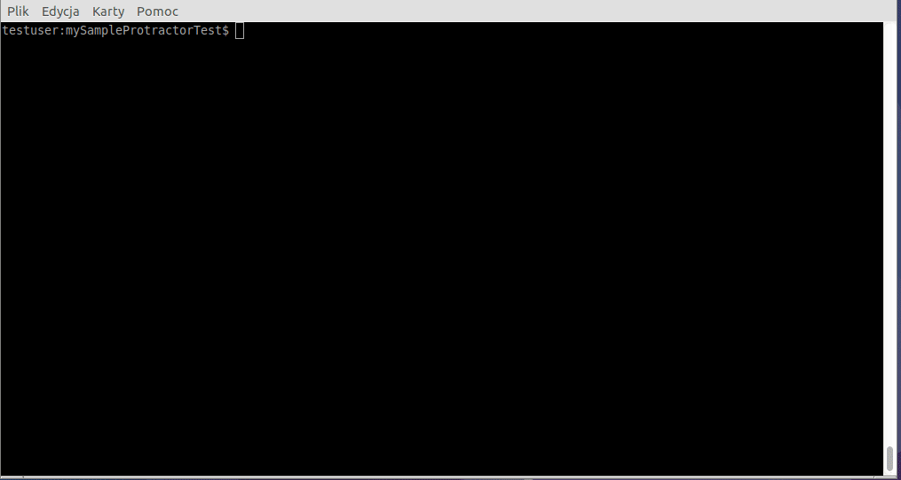

# mySampleProtractorTest

This test uses Protractor (http://www.protractortest.org/#/)
to verify whether switching between 'High contrast' and 'Normal version'
works properly on the page http://frontex.europa.eu/

To run test just type:
`npm test`
In case of information that Selenium folder doesn't exists, run the command:
`npm run webdriver-update`

Tested on Lubuntu 17.10 64-bit:

